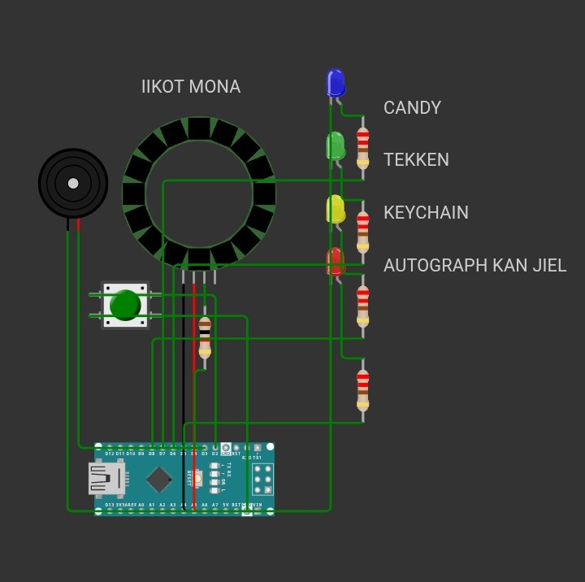

# Led-roulette-using-Arduino-

WIRING 

D2 → Button
D3 → Buzzer (+)
D4 → NeoPixel ring DIN (via resistor)
D5 → Red LED (via resistor)
D6 → Green LED (via resistor)
D7 → Blue LED (via resistor)
D8 → Yellow LED (via resistor)
A0 → unconnected
GND → common ground bus (button, buzzer, ring, LEDs, external supply)

